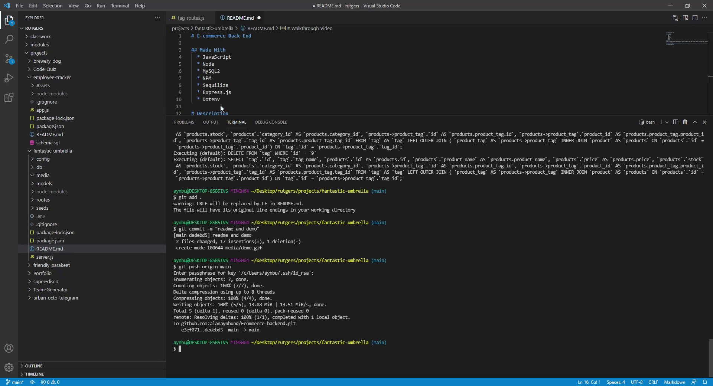

# E-commerce Back End

## Made With
  * JavaScript
  * Node
  * MySQL2
  * NPM
  * Sequilize
  * Express.js
  * Dotenv

# Description
I made a backend database and application for an e-commerce site. Add, delete, update, and create tags, products, and categories for the e-commerce site.

# Walkthrough Video

